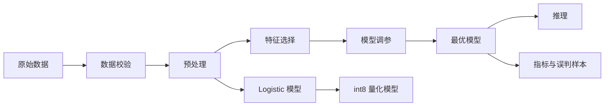

# 糖尿病预测实验报告

## 1. 项目概述

本项目面向糖尿病早期风险识别任务，使用结构化健康指标数据训练二分类模型，输出患者是否存在糖尿病风险及阳性概率。系统覆盖数据校验、特征处理、模型训练、模型评估、推理部署、量化推理和误判样本分析。

## 2. 数据来源与学术诚信

本地数据文件为 `diabetes_prediction_dataset.csv`，字段与 Kaggle Diabetes prediction dataset 一致。该公开数据集包含 100000 条样本、8 个输入特征和 1 个二分类标签 `diabetes`。关键字段包括年龄、性别、BMI、高血压、心脏病史、吸烟史、糖化血红蛋白和血糖水平。引用来源：https://www.kaggle.com/datasets/iammustafatz/diabetes-prediction-dataset

本项目代码由本仓库独立实现，未复制第三方项目代码。算法使用 scikit-learn 官方实现，实验报告和 README 中均标注了数据和算法来源。

## 3. 系统架构



## 4. 算法流程

1. 数据读取：自动尝试 `utf-8-sig`、`utf-8`、`gb18030`、`gbk` 编码。
2. 数据校验：检查必要字段、空数据、目标列二分类属性、缺失值和重复样本。
3. 预处理：年龄、BMI、HbA1c、血糖等数值字段进行中位数填充和标准化，性别、吸烟史等类别字段进行众数填充和独热编码。
4. 特征处理：使用互信息 `mutual_info_classif` 选择前 K 个重要特征，降低冗余和噪声。
5. 模型训练：比较逻辑回归、随机森林、梯度提升，并通过分层 K 折交叉验证选择 F1 最优模型。
6. 评估输出：生成准确率、精确率、召回率、F1、ROC-AUC、混淆矩阵、特征重要性和误判样本文件。
7. 量化部署：训练 Logistic 推理模型，将权重量化为 int8 JSON，保留 sklearn 预处理管线用于一致推理。

## 5. 参数设置

| 参数 | 默认值 | 说明 |
| --- | --- | --- |
| `test_size` | `0.2` | 测试集比例 |
| `validation_size` | `0.2` | 验证集比例 |
| `cv_folds` | `5` | 交叉验证折数 |
| `feature_k` | `10` | 互信息选择的特征数量 |
| `random_state` | `42` | 随机种子 |

## 6. 复现步骤

```bash
pip install -r requirements.txt
python scripts/train.py
python scripts/quantize.py
python scripts/predict.py --input diabetes_prediction_dataset.csv --output reports/predictions.csv
python scripts/predict.py --input diabetes_prediction_dataset.csv --model models/logistic_model.joblib --quantized-model models/logistic_int8.json --output reports/predictions_int8.csv
pytest
```

## 7. 实验结果填写说明

运行 `python scripts/train.py` 后，主要结果位于：

- `reports/metrics.json`：交叉验证、验证集、测试集指标。
- `reports/feature_importance.csv`：被选择特征、互信息分数和模型重要性。
- `reports/badcases.csv`：测试集错误样本及预测概率。
- `models/best_model.joblib`：最优模型权重。

## 8. 误判样本分析方法

优先检查 `reports/badcases.csv` 中阳性概率接近 0.5 的样本，这类样本通常处于决策边界附近。再结合 `feature_importance.csv` 分析 HbA1c、血糖、BMI、年龄等关键变量是否出现边界值或互相矛盾的特征组合。误判样本结论应作为模型改进线索，而不能直接替代医学诊断。

## 9. 后续优化

可进一步引入外部验证集、医学成本敏感阈值调优、SHAP 可解释性分析、模型校准和 Web/API 部署。医疗风险场景中，召回率通常应被优先关注，以降低漏检风险。
